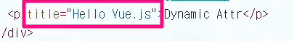
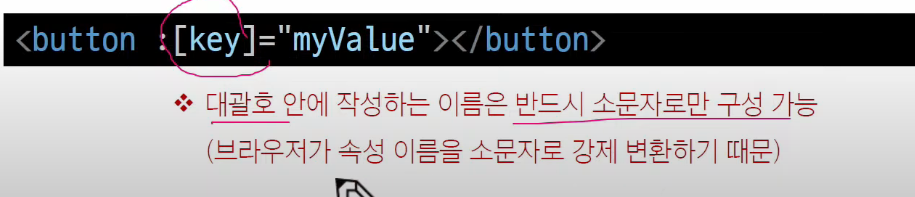

# Template Syntax

- DOM을 기본 구성 요소 인스턴스의 데이터에 선언적으로 바인딩(Vue Instance와 DOM을 연결)할 수 있는 HTML 기반 템플릿 구문(확장된 문법 제공)을 사용

1. Text Interpolation

Message: {{ msg }} 

- 데이터 바인딩의 가장 기본적인 형태
- 이중 중괄호 구문(콧수염 구문)을 사용
- 콧수염 구문은 해당 구성 요소 인스턴스의 msg 속성 값으로 대체 
- msg 속성이 변경될 때마다 업데이트 됨

2.
3.
4.

## Directive
- 'v-' 접두사가 있는 특수 속성

## Directive 특징
- Directive의 속성 값은 단일 javascript 표현식이어야 함
(v-for, v-on 제외)
- 표현식 값이 변경될 때 DOM 에 반응적으로 업데이트를 사용

- 예시

Hi There

seen => 자바스크립트 표현식이여야 한다. !!

---
### V-bind
하나 이상의 속성 또는 컴포넌트 데이터를 표현식에 동적으로 바인딩

v-bind 사용처
1. 속성 바인딩
2. 클래스, 스타일 바인딩

## Attribute Bindings(속성 바인딩)

- Dynamic attribute name 동적 인자 이름
    - 대괄호[] 로 감싸서 directive에 argument에 자.스 표현식을 사용할 수 있음
    - 표현식에 따라 동적으로 평가된 값이 최종 argument 값으로 사용됨

dynamicattr가 title 로 들어가 동적으로 사용됨을 알 수 있다. 
여기서 !!@
대괄호 안에 작성하는 이름은 반드시!!! 소문자로만 구성 가능💕
(브라우저가 속성 이름을 소문자로 강제 변환하기 때문)

## Class 와 Style Bindings(클래스와 스타일 바인딩)

- class와 style은 모두 HTML 속성이므로 다른 속성과 마찬가지로 `v-bin` 를 사용하여 동적으로 문자열 값을 할당할 수 있음
- Vue 는 class 및 style 속성 값을 v-bind 로 사용할 때 ***객체*** 또는 ***배열***을 활용하여 작성할 수 있도록 함 (여러값들을 넣기 위해!)
    -> 단순히 문자열 연결을 사용하여 이러한 값을 생성하는 것은 번거롭고 오류가 발생하기 쉽기 때문

## Event Handling

## `v-on`

`v-on` 의 약어
@event="handler"